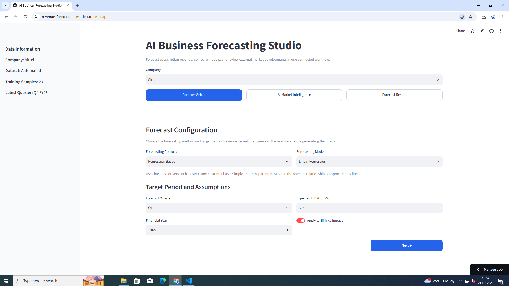
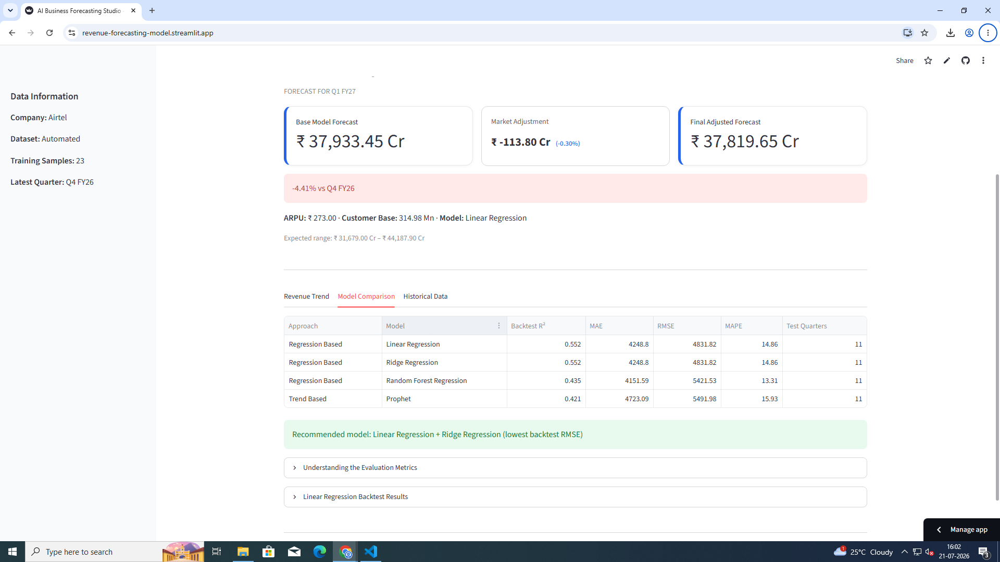
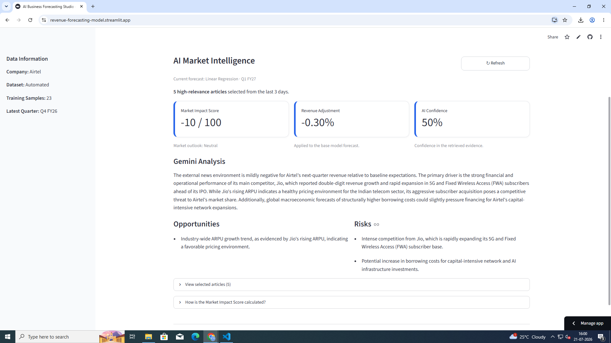
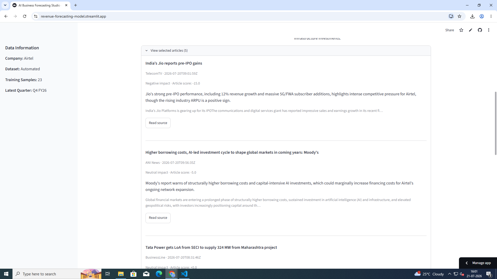
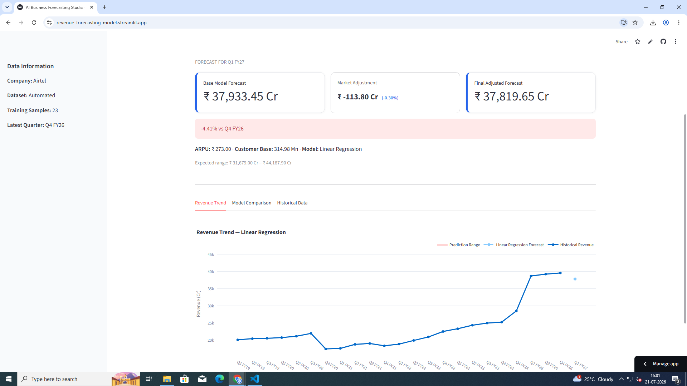

<p align="center">

# AI Business Forecasting Studio

### AI-Powered Revenue Forecasting & Market Intelligence Platform

Automatically extracts financial data from quarterly reports, compares multiple forecasting models, tests business scenarios, and enhances predictions using **Google Gemini**.


<br>


</p>

---

## Overview

AI Business Forecasting Studio is an end-to-end forecasting application that combines **machine learning**, **business scenario analysis**, and **AI-powered market intelligence**.

Instead of relying only on historical financial data, the platform analyses the latest business news using **Google Gemini**, allowing forecasts to be adjusted using current market conditions while remaining fully explainable.

The application automatically processes Airtel quarterly reports, builds historical datasets, trains multiple forecasting models, evaluates their performance, and presents everything through an interactive Streamlit dashboard.

Users can test Conservative, Base Case and Optimistic scenarios or customise the model-generated ARPU and subscriber assumptions. Inflation is calculated automatically using official quarterly CPI data derived from MoSPI rather than requiring a manual estimate.

You can try it out: https://revenue-forecasting-model.streamlit.app/

---

## Features

| 🚀 Feature | Description |
|------------|-------------|
| Automated Report Processing | Extract financial metrics directly from quarterly reports |
| Historical Dataset Generation | Build structured datasets automatically |
| Multiple Forecasting Models | Linear Regression, Ridge, Random Forest & Prophet |
| Model Evaluation | Compare models using MAE, RMSE, MAPE & R² |
| Scenario-Based Forecasting | Test Conservative, Base Case and Optimistic assumptions |
| Analyst Adjustments | Adjust model-generated ARPU and subscriber assumptions |
| Revenue Impact Breakdown | Separate the revenue effects of ARPU and subscriber adjustments |
| Automatic Inflation Baseline | Use official MoSPI CPI data to calculate quarterly inflation |
| AI Market Intelligence | Analyse live business news using NewsAPI & Gemini |
| Quota-Aware AI Fallback | Continue using the last successful analysis when Gemini quota is reached |
| Explainable Forecasting | Show why forecasts increase or decrease |
| Interactive Dashboard | Clean Streamlit interface for predictions |

---

# Dashboard

## Forecast Configuration



Choose the forecasting model, forecast period and business scenario. ARPU and subscriber assumptions can be adjusted before generating the forecast.

---

## Model Comparison



Compare every forecasting model before selecting the best performer.

---

## AI Market Intelligence



Google Gemini summarises news, identifies opportunities and risks, and estimates overall market impact.

If a genuine Gemini quota limit is reached, the application displays a warning and continues using the last successfully generated analysis.

---

## Article Analysis



Every retrieved article is individually analysed with AI to determine relevance and business impact.

---

## Final Forecast



The final prediction combines statistical forecasting, ARPU and subscriber assumptions, automatic inflation data, and AI-generated market intelligence to produce an explainable revenue forecast.

The Results page also separates the revenue effect of each analyst adjustment.

---

## Workflow

```text
Quarterly Reports
        ↓
PDF Processing
        ↓
Historical Dataset
        ↓
Machine Learning Models
        ↓
Base ARPU & Subscriber Forecast
        ↓
Business Scenario Adjustments
        ↓
Baseline Revenue Forecast
        ↓
NewsAPI
        ↓
Google Gemini
        ↓
Market Impact Analysis
        ↓
Final Revenue Prediction
```

---

## Technology Stack

| Category | Technologies |
|----------|--------------|
| Language | Python |
| Dashboard | Streamlit |
| Data Processing | Pandas |
| Machine Learning | Scikit-learn, Prophet |
| Visualisation | Plotly |
| AI | Google Gemini |
| APIs | NewsAPI |
| Inflation Data | MoSPI CPI |

---

## Project Structure

```text
AI-Business-Forecasting-Studio/
│
├── app.py
├── config.py
├── data/
├── models/
├── services/
├── ui/
├── utils/
├── images/
└── requirements.txt
```

---

## Installation

```bash
git clone https://github.com/sanianixon/revenue-forecasting.git

cd revenue-forecasting

pip install -r requirements.txt

streamlit run app.py
```

Create a `.env` file:

```env
NEWS_API_KEY=your_newsapi_key
GEMINI_API_KEY=your_gemini_api_key
```

---

## Future Improvements

- Support additional companies
- Add segment-level forecasting for mobile, broadband and enterprise revenue
- Export executive PDF reports
- Improve scenario calibration using historical outcomes
- Add additional macroeconomic indicators

---

## Author

**Sania Nixon**

GitHub: https://github.com/sanianixon

LinkedIn: https://linkedin.com/in/sania-nixon